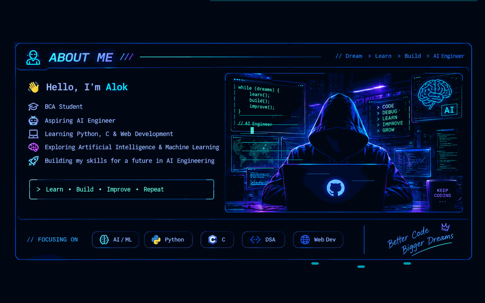

<div align="center">

<!-- ═══════════════════════════════════════════════════════════════ -->
<!--                    FUTURISTIC HEADER                           -->
<!-- ═══════════════════════════════════════════════════════════════ -->


<br>


<br><br>


</div>

<br>

---

# 🎯 CURRENTLY FOCUSING

<div align="center">

<table>
<tr>

<td width="50%" valign="top">

### 🤖 ARTIFICIAL INTELLIGENCE

🧠 Machine Learning  
🐍 Python for AI  
🔬 AI Fundamentals  
📊 Data & Algorithms  
🚀 Intelligent Systems  
💡 Problem Solving

</td>

<td width="50%" valign="top">

### 💻 DEVELOPER GROWTH

⚡ Data Structures & Algorithms  
🔧 Git & GitHub  
💻 Programming Fundamentals  
🌐 Web Development  
🧩 Logical Thinking  
📚 Strong Technical Foundation

</td>

</tr>
</table>

</div>

---

# 👨‍💻 ABOUT ME

<div align="center">



</div>

<br>

---

# ⚡ TECH ARSENAL

<div align="center">

### 💻 LANGUAGES


<br><br>

### 🛠️ TOOLS & PLATFORMS


<br><br>

### 🤖 AI / MACHINE LEARNING


</div>

---

# 🌌 WHAT I'M UP TO

<div align="center">

<table>

<tr>
<td width="50%" valign="top">

### 🔭 EXPLORING

Artificial Intelligence  
Machine Learning  
AI fundamentals  
Intelligent systems

</td>

<td width="50%" valign="top">

### 🌱 LEARNING

Python  
Data Structures  
Algorithms  
Problem Solving

</td>
</tr>

<tr>

<td width="50%" valign="top">

### 🧠 IMPROVING

Programming  
Logical thinking  
Development skills  
Technical foundation

</td>

<td width="50%" valign="top">

### 🚀 BUILDING MY FUTURE

Becoming an AI Engineer  
Learning every day  
Building better skills  
Turning ideas into code

</td>

</tr>

</table>

</div>

---

# 🧊 3D CONTRIBUTION UNIVERSE

<div align="center">


</div>

---

# 📊 GITHUB PERFORMANCE

<div align="center">


<br><br>


</div>

---

# 🧠 MY DEVELOPER MINDSET

<div align="center">

```text
╔══════════════════════════════════════════════════════╗
║                                                      ║
║       DREAM  →  LEARN  →  BUILD  →  IMPROVE         ║
║                                                      ║
║       CODE  →  DEBUG  →  LEARN  →  REPEAT           ║
║                                                      ║
║       TODAY'S LEARNING = TOMORROW'S SKILL            ║
║                                                      ║
╚══════════════════════════════════════════════════════╝
